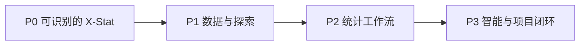

# 总路线图

对照文档《X-Stat开发需求要点说明》与当前 jamovi 代码，按可交付增量分期。每一期结束都应能装包试用，而不是等全部统计流程做完才见界面。

## 产品目标

把 jamovi 改造成 **X-Stat**：面向定量病理标志物分析，用规范流程（单组 → 单因素 → 多因素）指导统计与可视化，并与 X-Lab 的项目卡片衔接。

文档列出的关键缺口：

1. 复杂模型缺少逐步策略（尤其生存分析）
2. 无法对大量定量指标做批处理
3. 比例分析类型多、制图逻辑未收敛
4. 聚类热图无法叠加临床变量
5. 导出不友好
6. Box Plot 样式单一、不显示 p 值，不能直接用于文章

## 代码底座（对照现状）

```
Electron 壳     electron/app/          窗口、启动页、图标、productName
Client UI       client/main/           Ribbon、Backstage、结果面板
分析引擎        server/jamovi/server/  会话、导出、模块扫描
R 模块          jmv/ + plots/          统计与 EDA 图
模块安装        docker/jamovi-Dockerfile
                JAMOVI_MODULES_PATH
```

Ribbon 现有 Tab：变量 / 数据 / 分析 / 绘图 / 编辑。  
左上汉堡菜单 = 文件 Backstage；右上竖三点 = AppMenu（缩放、主题、语言）。

## 分期



| 阶段 | 目标 | 用户能做什么 | 预估工作量 |
|---|---|---|---|
| **P0** | 品牌 + 壳 + 文件 IO + 模块白名单 | 打开就是 X-Stat，指定插件在菜单里，导出分数据和结果 | 2–3 周 |
| **P1** | 清洗、EDA、批处理、发表级箱线图 | 清洗数据、批量出探索图、箱线图带 p 值 | 3–5 周 |
| **P2** | 组间 / 比例 / 相关 / 生存 / 聚类 | 按文档流程做标志物分析，而不是东点一个菜单 | 6–10 周 |
| **P3** | AI 解读、存档、X-Lab | 批量结果可筛可读，项目在 X-Lab 可回溯 | 4–6 周 |

P0/P1 主要改本仓库。P2 大量工作在外部 R 模块。P3 依赖产品与后端接口。

## 需求 → 任务对照

| 文档条目 | 动作 | 任务文件 |
|---|---|---|
| 全界面去 jamovi 品牌，换 X-Stat | 改造 | [01](./01-branding.md) |
| 启动页 / 关于 / 窗口标题 / 图标 / 安装包 | 改造 | [01](./01-branding.md) |
| 标题栏深蓝色（与 X-Lab 一致） | 改造 | [01](./01-branding.md)、[02](./02-shell-ux.md) |
| 左上「三」改为「项目」菜单 | 改造 | [02](./02-shell-ux.md) |
| 右上竖三点改为「设置」 | 改造 | [02](./02-shell-ux.md) |
| 右侧「分析方法说明」悬浮栏 | 新增 | [02](./02-shell-ux.md) |
| 保持变量 / 数据 / 分析面板 | 保持 | — |
| 绘图面板改为数据探索 EDA | 改造 | [06](./06-eda-plots.md) |
| 保持编辑面板 | 保持 | — |
| 特殊导入 → 数据替换，挪到数据面板 | 改造 | [03](./03-file-io.md) |
| 导出拆成「原始数据」和「结果」 | 改造 | [03](./03-file-io.md) |
| 预装常用插件，分析面板只显示指定模块 | 改造 | [04](./04-modules.md) |
| jReshape 预装并挪到数据面板 | 改造 | [04](./04-modules.md)、[05](./05-data-cleaning.md) |
| 缺失 / 异常 / 标准化 / 正态化专用工具 | 新增 | [05](./05-data-cleaning.md) |
| EDA 8 个绘图按钮 + 批处理导出 | 改造/新增 | [06](./06-eda-plots.md)、[07](./07-batch.md) |
| Alluvial 挪到绘图；和弦图新做 | 改造/新增 | [06](./06-eda-plots.md) |
| Box Plot 显示 p 值、可直接用于文章 | 改造 | [06](./06-eda-plots.md) |
| 批处理：单指标生存 / 组间比较 | 新增 | [07](./07-batch.md) |
| 比例分析流程与制图 | 新增 | [08](./08-stats-workflows.md) |
| 组间比较方法向导（t / Welch / U / ANOVA / KW 等） | 新增 | [08](./08-stats-workflows.md) |
| 相关 / 偏相关 | 改造 | [08](./08-stats-workflows.md) |
| 生存：单因素 KM → 多因素 Cox → ROC | 新增流程 | [09](./09-survival-roc.md) |
| LASSO-Cox（Rj + glmnet） | 封装 | [09](./09-survival-roc.md) |
| 聚类热图 + 临床注释条 | 改造 | [10](./10-clustering.md) |
| 聚类后列联表 / KM / Cox / ROC 验证 | 流程串联 | [10](./10-clustering.md) |
| AI 解读批量结果 | 新增 | [11](./11-ai-archive.md) |
| 总结存档 | 新增 | [11](./11-ai-archive.md) |
| 项目管理放在 X-Lab | 外部 | [12](./12-xlab.md) |
| FDR 多重校正 | 暂缓 | [99](./99-open-questions.md) |

## 依赖关系

```
01 品牌 ──┐
02 壳 UX ─┼─► 03 文件 IO ─► 04 模块白名单 ─► 05 清洗
          │                                      │
          └──────────────────────────────────────┴─► 06 EDA ─► 07 批处理
                                                          │
                    08 组间/比例/相关 ────────────────────┤
                    09 生存/ROC ──────────────────────────┼─► 11 AI/存档
                    10 聚类 ──────────────────────────────┘
                                                          │
                                                    12 X-Lab
```

P0 内部：01 可与 02 并行，03 依赖 Backstage 改造（02 的项目菜单）。04 可与 01 并行。

## 本仓库优先改动的文件（P0 地图）

| 目的 | 路径 |
|---|---|
| 应用名 | `client/main/host.ts`、`electron/app/package.json`、`electron/app/preload.js`、`server/jamovi/server/appinfo.py` |
| 窗口标题 / 启动页 | `client/index.html`、`electron/app/splash.html` |
| Logo | `client/assets/logo-*.svg`、`client/common/icon.ts`、`platform/app-icon.svg` |
| 标题栏颜色 | `client/main/jamovi.css`、`client/main/ribbon.css`、`client/main/backstage.css` |
| 汉堡 → 项目 | `client/main/ribbon.ts` |
| 竖三点 → 设置 | `client/main/ribbon/appmenu.ts` |
| 文件菜单 / 导入导出 | `client/main/backstage.ts` |
| 欢迎页 | `client/main/results.ts` |
| 分析 / 绘图菜单 | `client/main/ribbon/analysetab.ts`、`plotstab.ts`、`client/main/modules.ts` |
| 模块扫描与预装 | `server/jamovi/server/modules/modules.py`、`docker/jamovi-Dockerfile` |
| 导出实现 | `server/jamovi/server/instance.py`、`server/jamovi/server/formatio/` |

## 合规

本仓库许可证为 AGPL3 / GPL2+。替换界面品牌不等于删除开源义务：

- 保留 `LICENSE.md`
- 关于页写明基于 jamovi 开源项目
- 结果引用里保留 jamovi / R 条目（文案可并列 X-Stat）

## 验收总闸

- P0：安装后窗口、启动页、关于、图标均显示 X-Stat；分析菜单只有白名单模块；能分别导出数据和结果。
- P1：能清洗一批定量指标、批量导出 EDA 图、箱线图带组间 p 值。
- P2：能按文档走完「单因素生存 + 多因素 Cox」和「层次聚类 + 临床注释 + KM 验证」两条主路径。
- P3：批量结果可生成解读草稿；X-Lab 卡片能链到对应 `.omv` 与导出目录。
